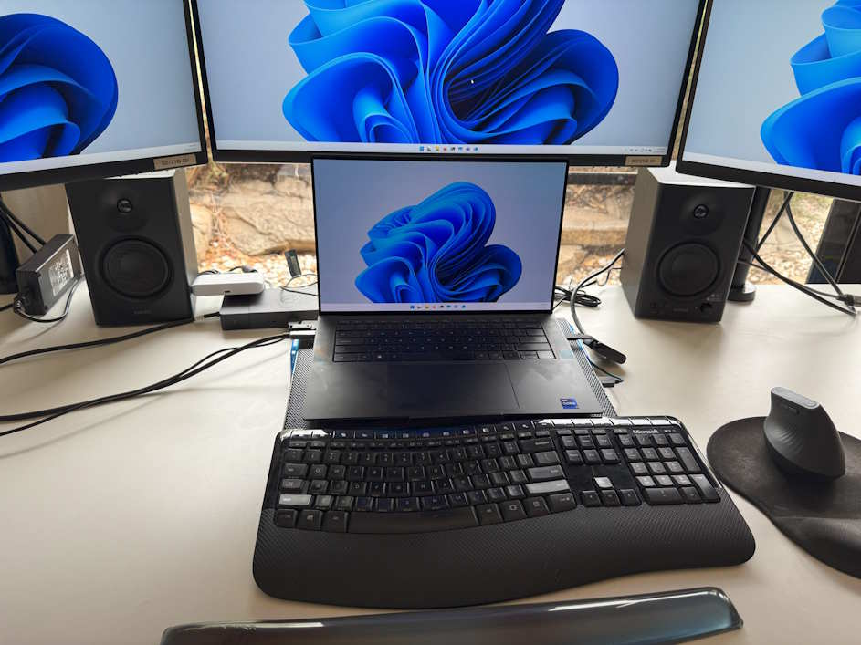
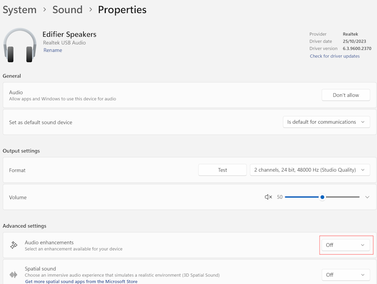

I quite often like to have music playing in the background when I'm working. [Double J](https://www.abc.net.au/listen/doublej) is my default choice, though I sometimes will pick out an old CD that I have copied onto my Synology, or for that rare time when I'm under the pump then some calming classical music (via [ABC Classic 2](https://www.abc.net.au/listen/live/classic2)) is just the ticket.

Also worth calling out that this isn't something you can easily do if you work in an office unless you have your own room or you're happy to wear headphones. Kind of funny that earlier in my career I did have my own private office, but later on the transition to open-plan seating came into fashion and I'm not keen on wearing headphones all day so music listening was put on hold. So yeah, another big plus for working from home!

The speakers on my [Dell XPS 9530](/2023/04/new-laptop.html) are surprisingly good, but I wondered if adding some external speakers might make it even better.

I had accrued some [SixPivot "Good Vibes points"](https://handbook.sixpivot.com.au/perks-and-benefits/rewards-shop), so I thought I'd spend some of those on some new speakers.

There's so many options, so I asked my colleagues for recommendations. Two caught my attention:

- [Creative Stage Air PC V2 Under Monitor Soundbar](https://www.amazon.com.au/Creative-Under-Monitor-Bluetooth-Dual-Driver-Compatible/dp/B0B28MG2SL?th=1&linkCode=ll1&tag=flcdrg07-22&linkId=1fc52f0f8f21eb9dd368409491bb7b26&language=en_AU&ref_=as_li_ss_tl)
- [Edifier MR4 Powered Studio Monitor Speakers](https://www.amazon.com.au/dp/B09FX5FZ6Y?th=1&linkCode=ll1&tag=flcdrg07-22&linkId=599f7effce2769beb32fe6ba48758575&language=en_AU&ref_=as_li_ss_tl) (affiliate links)

The Soundbar was the cheaper option so I went with that. I plugged it in and was all excited to hear wonderful improved sound, but queue the sad trombones - it was very disappointing. The sound was muddy, like listening to an old AM radio. Needless to say I sent it back.

I then decided to give the Edifier speakers a try. My colleague [Rebecca](https://becdetat.com/) had a positive experience with these, so I was hopeful.

They're actually just speakers - no Bluetooth or USB inputs, which was actually my preference. Do one thing and hopefully it will do it well! They arrived and I plugged them into my laptop, and they sounded really nice.

I'm relatively tall, so I have my monitors raised up on monitor stands, which means the speakers just sit nicely in the gap underneath.

While my laptop does have an audio jack, I realised that my Dell WD19TB Dock also has one, and figured that would be a better option to use long-term. Then I just need to unplug the one Thunderbolt cable for those times I want to take my laptop to the sofa while watching TV.

But to my surprise, the audio quality went really bad - a lot like the Creative speaker. A bit of online searching and I found a comment that said to set **Audio enhancements** to **Off** in the device properties. That fixed the problem! (I'm now wondering if that might have been the cause of the poor experience with the Creative Soundbar?)

I also made use of the **Rename** option to rename the device so I can tell them apart from the other audio devices on the machine. It's a pity you can't change the icon from headphones to desk speakers, but that's not a big deal.

The speakers have RCA and TRS inputs on the rear. There's also an Aux input and headphone output jack on the front of the right speaker. I used the supplied RCA to 3.5mm cable to connect to my laptop/dock. My limited understanding is that the TRS jack is intended for connecting to a 'balanced' device like an audio mixer, not a computer. There's more technical data about the speakers on the [Edifier site](https://edifier.com.au/products/edifier-mr4-p-au).

One thing to be aware of if you regularly turn off the power to your devices when you're not using them (like I do to save power) - when mains power is restored they default to 'off' mode. So you need to press the power button on the front of the speakers to turn them on.

So thanks Rebecca, those were a good recommendation. I'm enjoying them a lot!
