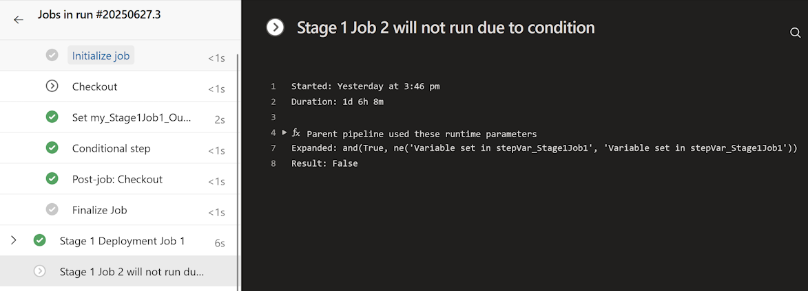

There are two main ways to make parts of your Azure Pipeline conditional:

1. Add a custom `condition` to the step, job or stage.
2. Use conditional insertion with template expressions.

In this post we'll look at custom conditions.

### Custom conditions

[Custom conditions](https://learn.microsoft.com/azure/devops/pipelines/process/conditions?view=azure-devops&WT.mc_id=DOP-MVP-5001655) are evaluated at runtime.

Here's an example of a step with a custom condition which causes it to be skipped if the pipeline runs on a branch other than 'main':

```yaml
- script: echo "hello world"
  condition: eq(variables['Build.SourceBranchName'], 'main')
```

You can use any of the [Job status check functions](https://learn.microsoft.com/azure/devops/pipelines/process/expressions?view=azure-devops&WT.mc_id=DOP-MVP-5001655#job-status-functions) for the condition expression, or to form part of it:

- `always()` - evaluates to `True`
- `canceled()` - evaluates to `True` if the pipeline was cancelled
- `failed()` - evaluates to `True` if any previous dependent job failed.
- `failed(JOBNAME)` - evaluates to `True` if the named job failed.
- `succeeded()` - evaluates to `True` all previous dependent jobs succeeded or partially succeeded
- `succeeded(JOBNAME)` - evaluates to `True` if the named job succeeded
- `succeededOrFailed()` - evalutes to `True` regardless of any dependent jobs succeeding or failing
- `succeededOrFailed(JOBNAME)` - evalates to `True` if the job succeeded or failed

Often you'll combine these with the [`not()`](https://learn.microsoft.com/azure/devops/pipelines/process/expressions?view=azure-devops&WT.mc_id=DOP-MVP-5001655#not) function. For example:

- `not(cancelled())` - evaluates to `True` if no dependent jobs were cancelled. This is often the best choice where there's a chance one of the dependent jobs may have been skipped (which means it has neither succeeded or failed)
- `not(always())` - evaluates to `False`. Useful if you wish to ensure a step, job or stage is always skipped, for example as a temporary measure while you're debugging a problem with a pipeline.

You can reference predefined and custom pipeline variables in the expression. In addition to the `not()` function we've just seen, the other functions I most commonly use are:

- `eq()` - Evaluates to `True` if the two parameters are equal (string comparisons are case-insensitive)
- `ne()` - Evaluates to `True` if the two parameters are not equal
- `and()` - Evaluates to `True` if all the parameters (2 or more) are `True`
- `or()` - Evaluates to `True` if any of the parameters (2 or more) are `True`

There are [more functions documented](https://learn.microsoft.com/azure/devops/pipelines/process/expressions?view=azure-devops&WT.mc_id=DOP-MVP-5001655#functions) that may be useful in more unique scenarios.

Be aware that as soon as you add a custom condition then the evaluation of the expression will determine whether that step, job or stage is executed. This can mean it ignores any previous failures or cancellations (which may not be what you intended!)

eg. This step will always be executed when the current branch is 'main', even if previous steps have failed.

```yaml
- script: echo "hello world"
  condition: eq(variables['Build.SourceBranchName'], 'main')
```

To preserve the more common behaviour of skipping the step if any previous steps have failed you need to use this approach:

```yaml
- script: echo "hello world"
  condition: and(succeeded(), eq(variables['Build.SourceBranch'], 'main'))
```

This also means that the condition in the next example is effectively redundant. If you see code like this then I'd recommend deleting the condition - it's just noise!

```yaml
- script: echo "hello world"
  condition: succeeded()
```

Another common scenario is when a task creates output variables that you can then use to determine if subsequent tasks need to be run. The [Terraform tasks](https://marketplace.visualstudio.com/items?itemName=JasonBJohnson.azure-pipelines-tasks-terraform) are a good example - if the 'Plan' task does not identify any required changes, then you can safely skip the 'Apply' task.

eg.

```yaml

- task: TerraformCLI@2
  displayName: "Terraform: plan"
  inputs:
    command: plan
    workingDirectory: "$(TerraformSourceDirectory)"
    commandOptions: -no-color -input=false -detailed-exitcode
    environmentServiceName: Azure MSDN - rg-tfupgrade-australiasoutheast
    publishPlanResults: Plan
    allowTelemetryCollection: false

- task: TerraformCLI@2
  displayName: "Terraform: apply"
  condition: and(succeeded(), eq(variables['TERRAFORM_PLAN_HAS_CHANGES'], 'true'))
  inputs:
    command: apply
    workingDirectory: "$(TerraformSourceDirectory)"
    commandOptions: -no-color -input=false -auto-approve
    allowTelemetryCollection: false
```

If you want to use a condition where the expression needs to reference an output variable from a previous job or stage, then you will need to first declare that variable in the current job or stage's variable block. You can then reference it in the condition expression.

eg. For jobs:

```yaml

      - job: Job1
        steps:
          - bash: echo "##vso[task.setvariable variable=my_Job1_OutputVar;isOutput=true]Variable set in stepVar_Job1"
            name: stepVar_Job1

      - job: Job2
        dependsOn: Job1
        condition: and(succeeded(), eq( variables.varFrom_Job1, 'Variable set in stepVar_Job1'))
        variables:
          varFrom_Job1: $[ dependencies.Job1.outputs['stepVar_Job1.my_Job1_OutputVar'] ]
```

and for stages (note the use of `stageDependencies`):

```yaml
  - stage: Stage1
    jobs:
      - job: Stage1Job1
        steps:
          - bash: echo "##vso[task.setvariable variable=my_Stage1Job1_OutputVar;isOutput=true]Variable set in stepVar_Stage1Job1"
            name: stepVar_Stage1Job1

  - stage: Stage3
    displayName: Stage 3
    dependsOn: Stage1
    condition: and(succeeded(), eq(variables.varFrom_Stage1DeploymentJob1, 'Variable set in stepVar_Stage1Job1'))
    variables:
      varFrom_Stage1DeploymentJob1: $[ stageDependencies.Stage1.Stage1DeploymentJob1.outputs['Stage1DeploymentJob1.stepVar_Stage1DeploymentJob1.my_Stage1DeploymentJob1_OutputVar'] ]

```

Take a look at the pipelines defined in my [azure-pipelines-variables GitHub repository](https://github.com/flcdrg/azure-pipelines-variables) for more examples of these.

Here's an example of a pipeline run with custom conditions similar to the code excerpts above:



For activities that were skipped, when you select the specific task, job or stage, you can view the conditional expression and the actual parameters that were used in its evaluation to understand why it resulted in a `False` value. In the screenshot above, notice that while the `succeeded()` function evaluated to `True`, the `ne()` function did not, and because those two were combined with an `and()` then the final result was also `False`.

In the next post we'll look at conditional insertion with template expressions and discuss when you'd use that approach over custom conditions.
