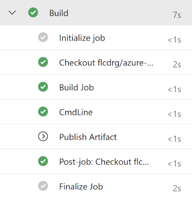
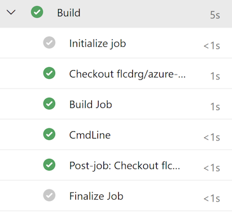

In my [last post](/2025/06/azure-pipeline-conditionals) I wrote about using custom conditions in Azure Pipelines to evaluate whether to skip a step, job or stage at runtime.

Sometimes we can do better though. With template expressions we can not just skip something, we can remove it entirely. We can also use it to optionally insert values in a pipeline (something you can't do with runtime custom conditions).

The important thing to remember is that template expression are a "compile time" feature. They can only operate on things that are available at compile time. [Variables set by scripts](https://learn.microsoft.com/azure/devops/pipelines/process/set-variables-scripts?view=azure-devops&WT.mc_id=DOP-MVP-5001655), and [task output variables](https://learn.microsoft.com/azure/devops/pipelines/process/variables?view=azure-devops&tabs=yaml%2Cbatch&WT.mc_id=DOP-MVP-5001655#use-output-variables-from-tasks) are two examples of things that are not available at compile time.

Compare these two Azure Pipeline runs. The first uses custom conditions to decided if the 'Publish Artifact' step is executed or not. Notice the 'Publish Artifact' step is listed, but the icon shown is a white arrow (rather than green tick)


If we use a template expression, then if it evaluates to false then the step is not even included in the job!



[Template expressions](https://learn.microsoft.com/azure/devops/pipelines/process/template-expressions?view=azure-devops&WT.mc_id=DOP-MVP-5001655) use the syntax `${{ }}`

You can reference `parameters` and `variables` in template expressions. The latter are only variables that are defined in the YAML file and most of the [predefined variables](https://learn.microsoft.com/en-us/azure/devops/pipelines/build/variables?view=azure-devops&WT.mc_id=DOP-MVP-5001655). (That page does list which variables can be used in template expressions, but you may need to scroll the page to the right to see that column!)

You can't reference variables that are created by scripts or anything else that is only available at runtime.

You can use [general functions](https://learn.microsoft.com/azure/devops/pipelines/process/expressions?view=azure-devops&WT.mc_id=DOP-MVP-5001655#functions) (the same ones we used previously with runtime Custom Conditions) in template expressions, as well as two special [Template expression functions](https://learn.microsoft.com/en-us/azure/devops/pipelines/process/template-expressions?view=azure-devops&WT.mc_id=DOP-MVP-5001655#template-expression-functions).

## Common patterns

You can see a complete pipeline demonstrating all the following patterns at <https://github.com/flcdrg/azure-pipelines-template-expressions/blob/main/azure-pipelines.yml>.

### Conditionally include stage, job or step

The official documentation calls this [Conditional Insertion](https://learn.microsoft.com/en-au/azure/devops/pipelines/process/template-expressions?view=azure-devops&WT.mc_id=DOP-MVP-5001655#conditional-insertion).

Here's an example where we only want to publish build artifacts if we're building the main branch:

<!-- snippet: TemplateExpression-conditional-step -->
```yml
- ${{ if eq(variables['Build.SourceBranch'], 'refs/heads/main') }}:
    - publish: $(Build.ArtifactStagingDirectory)
      artifact: drop
      displayName: "Publish Artifact"
```
<!-- endSnippet -->

### Conditionally set variable

Using template expressions to conditionally set the values of variables is a common use case.

<!-- snippet: TemplateExpression-variables1 -->
```yml
variables:
  ${{ if eq(variables['Build.SourceBranch'], 'refs/heads/main') }}:
    Environment: "Production"
  ${{ else }}:
    Environment: "Not-Production"
```
<!-- endSnippet -->

Note that YAML formatting rules apply - each property must be unique, so you can't repeat the expression line more than once. Instead you would just group additional variable declarations together.

### Conditionally set stage or job dependency

DependsOn applies to stages and jobs. We can conditionally include the entire dependency:

<!-- snippet: TemplateExpression-conditional-dependson -->
```yml
${{ if ne(parameters.DependsOn, '') }}:
  dependsOn:
    - Version
```
<!-- endSnippet -->

Or when we have multiple dependencies, we can conditionally include an additional dependency. Because dependsOn in this case is referring to an array, we need to use the array syntax for our template expression.

<!-- snippet: TemplateExpression-conditional-dependson-extra -->
```yml
dependsOn:
  - Version
  - ${{ if ne(parameters.DependsOn, '') }}:
      - ${{ parameters.DependsOn }}
```
<!-- endSnippet -->

### Looping

The official name for this in the documentation is [Iterative insertion](https://learn.microsoft.com/azure/devops/pipelines/process/template-expressions?view=azure-devops&WT.mc_id=DOP-MVP-5001655#iterative-insertion).
Loop expressions are a powerful technique that can be used to reduce duplication in your pipelines.

If you need to define an array, the only way I'm aware of doing that is by declaring a parameter, as one of the types supported by parameters is `object`. As an object, you can use YAML to define it as an array and add sub-properties etc to that as required.

<!-- snippet: TemplateExpression-parameters -->
```yml
parameters:
  - name: Environments
    type: object
    default:
      - name: Dev
        displayName: "Development"
      - name: Test
        displayName: "Testing"
      - name: Prod
        displayName: "Production"
```
<!-- endSnippet -->

I tend to add a `displayName` on those parameters just to make it clear they're just there to store the array data (and you probably shouldn't be altering the values in the Azure Pipelines web UI if you run the pipeline manually)

<!-- snippet: TemplateExpression-conditional-each -->
```yml
- ${{ each env in parameters.Environments }}:
    - stage: DeployTo${{ env.name }}
      jobs:
        - job: DeployTo${{ env.name }}
          displayName: "Deploy to ${{ env.name }}"
          steps:
            - script: echo "Deploying to ${{ env.name }} environment..."
              displayName: "Deploy to ${{ env.name }}"
```
<!-- endSnippet -->

## Conclusion

Template expressions are a powerful feature. Curiously, despite GitHub Actions having many similarities to Azure Pipelines, this is one aspect that they didn't port over.

Often I see custom conditions being used where template expressions would be a better fit. It's worth considering if using them more could simplify and improve your pipelines.
