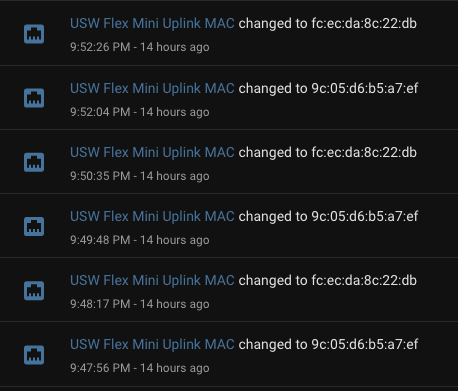
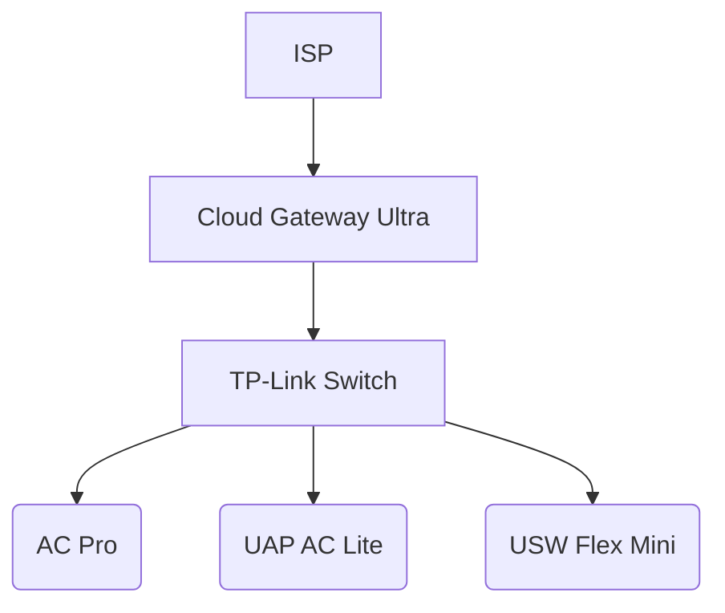
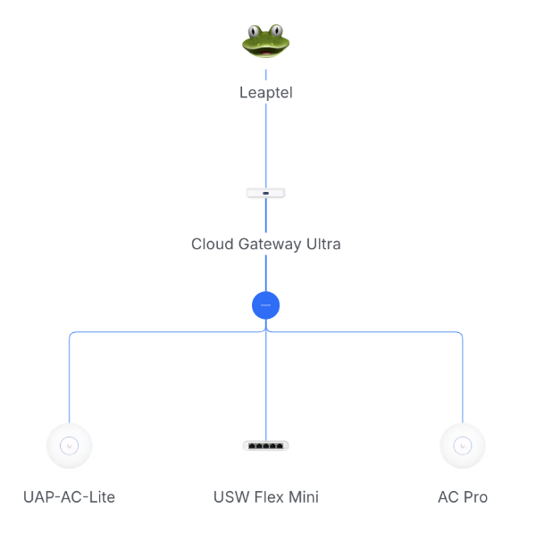
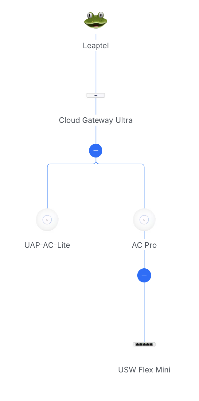

A couple of months ago a suggestion came up at home about getting some kind of low-powered light in the hallway for people who might need to go to the bathroom in the middle of the night. Not an unreasonable request - maybe some LED strip lights would work? And then I wondered, how about adding a motion sensor? And then could you integrate it with some home automation of some kind? And that's how I ended up completely distracted looking at [Home Assistant](https://www.home-assistant.io/)!

Installing it on our Synology NAS seemed the logical choice, and it was pretty straightforward, going down the Docker container route. I clicked around the UI and it looked interesting, but didn't go much further (and I must admit by that time I'd forgotten the original reason for heading down this rabbit hole).

Then a couple of weeks ago we got a new car (a Kia EV5) and it has an app that you can use to check current status and some limited remote control options. Given the need to charge it at home started me off on a new area of research for home charging devices, and also considering the current state of our home solar panels - whether to upgrade them, or at least figure out how to replace some that have had to be taken out of service due to impact damage.

That inspired me to go back and take another look at my Home Assistant instance, and see if I could add some 'integrations' with some of the existing networked devices we already have. It turns out our current model solar panel inverter (a [Fronius](https://www.fronius.com/en-au/australia/solar-energy/home-owners)) is supported, as well as the [Ubiquiti UniFi](https://techspecs.ui.com/unifi) networking gear I have installed. That is pretty cool.

And that is a very long way of getting to the point of this blog post - once I had these devices integrated, I noticed in Home Assistant's **Activity** page, that there were heaps of these entries being logged for my UniFi [USW Flex Mini](https://www.amazon.com.au/Ubiquiti-Flex-Managed-Gigabit-Switch/dp/B08VRV9PWD?&linkCode=ll2&tag=flcdrg07-22&linkId=0dfeac74af4a36b6280c22ca74a2afad&ref_=as_li_ss_tl) switch:

For some reason, either the Flex Mini switch itself, or my [UniFi Cloud Gateway Ultra](https://www.amazon.com.au/Ubiquiti-UniFi-Cloud-Gateway-Ultra/dp/B0D8PSW2BZ?&linkCode=ll2&tag=flcdrg07-22&linkId=39ad4320d21517a1048ccd7df111cbd5&ref_=as_li_ss_tl) thinks that the uplink MAC address for the switch is changing every minute. That is really weird.

The physical arrangement of networking hardware in our home looks roughly like this:

I had to do some hunting within the Cloud Gateway UI to figure out what the devices where that corresponded to the two MAC addresses.

One was indeed the gateway (which is what I would expect). The second, surprisingly turned out to be [AC Pro wireless access point](https://www.amazon.com.au/UAP-AC-PRO-UBIQUITI-Ac1750-Access-Injector/dp/B07JDNS774?&linkCode=ll2&tag=flcdrg07-22&linkId=bfe6e1c092cbf6dbf88d14b28e295ed4&ref_=as_li_ss_tl). That doesn't make a lot of sense - it's a wireless access point. It should not be acting as the upstream for a wired device.

It's funny though. Once you're paying attention to something, you often notice other things that have probably been there the whole time.

Switching to the Cloud Gateway UI and bringing up the **Network** page, I noticed something interesting.

At first it looked as I would have expected:

But then while on that page it updated and woah! That lines up with those logs!

Both the Flex Mini switch and the AC Pro access point use Power over Ethernet (PoE), and the [TP-Link switch](https://www.amazon.com.au/TP-Link-Gigabit-Ethernet-Unmanaged-TL-SG1008P/dp/B00BP0SSAS?th=1&linkCode=ll2&tag=flcdrg07-22&linkId=6bbad2b757ca1431cfe8c2b8e50ccbfc&ref_=as_li_ss_tl) provides that on some of its ports so I had them both plugged into that.

The TP-Link is not a managed switch. It is essentially 'invisible' to other devices on the network (notice how it doesn't show up on those Gateway Network diagrams above), so I wonder if that may be relevant?

To test this theory, I changed the cables so that the Flex Mini is plugged directly into the Cloud Gateway. But as the gateway doesn't provide PoE I needed to power the Mini directly through its USB-C port.

Making that change, and now the Cloud Gateway's Network page reverts back to the expected layout and doesn't change. Home Assistant's Activity log also becomes a lot quieter.

That seems to have solved the problem. I'd really prefer to keep using PoE for the Flex Mini switch, but I suspect to do that in a reliable way might mean replacing the unmanaged TP-Link switch with a newer managed one - something like the UniFi [USW Lite 8](https://www.amazon.com.au/Ubiquiti-UniFi-Switch-8-Port-Network/dp/B0C6BPKXDF?&linkCode=ll2&tag=flcdrg07-22&linkId=5a4b1ea1f998e5eb75850909842534ac&ref_=as_li_ss_tl) or [USW Ultra](https://www.amazon.com.au/Ubiquiti-Ultra-8-Port-Network-Switch/dp/B0CR1YNLXC?&linkCode=ll2&tag=flcdrg07-22&linkId=a2f9311298976c19d21acec1f9d7eb81&ref_=as_li_ss_tl). Except it does seem the price jumps quite a bit when you go from 5 ports to 8. Maybe I'll stick with the USB-C power option for now.

Amazon affiliate links
